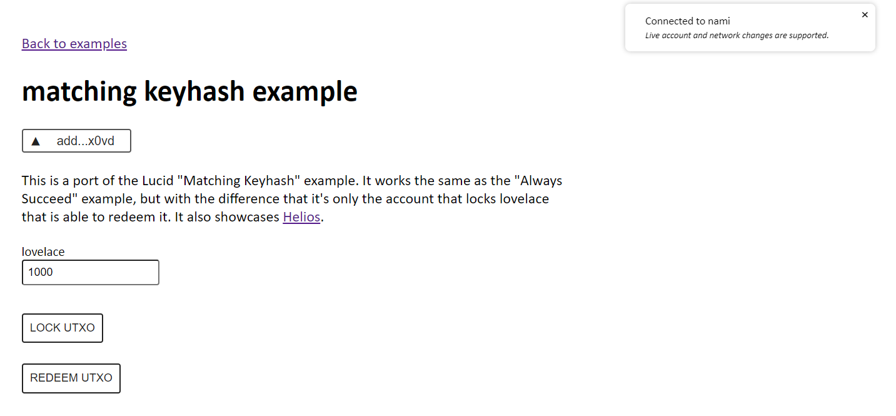

# USE CARDANO

## Unreleased 

**OBS!! This project is unreleased. Feel free to use it, but be aware that it is to be considered as an alpha version. Things can break, the APIs will change etc.**

## At a glance

`use-cardano` is a react hook that makes interacting with the Cardano blockchain easy. The library lets you connect web3 dapp wallets using the [CIP-30 Web Bridge](https://cips.cardano.org/cips/cip30/) and [lucid-cardano](https://github.com/spacebudz/lucid). It is written in TypeScript and uses the aforementioned library lucid-cardano for functionality such as signing transactions.

## Philosophy

While the library largely builds on `cardano-lucid` for core functionality, I went with the more generic name `use-cardano` to signify that I intend to expand beyond the core concepts with QoL utility functions, hooks and components. The purpose of this package is to make it as easy as possible to get started building Cardano dApps with React, and I hope this will lower the bar of entry into Cardano dApps development.

### Usage of React.context

The library heavily relies on [React Context](https://reactjs.org/docs/context.html). This makes it very easy to access the state of the library from anywhere in the component tree. However, it also means that there is a possible performance cost, as context updates are potentially expensive. I have tried to mitigate this by using `useMemo` and `useCallback` to memoize the context values and setters, but I am not sure if this is enough, since this is still to be proven in a real world case. I don't forsee this being an issue, since the states should only update rarely, as the user interacts with the wallet provider, but if you experience performance related issues, please let me know.

## Docs

A stand-alone documentation page is coming soon (tm).

## Usage

1. Install the package `npm install use-cardano`
1. Install the package's peerDependencies `npm i lucid-cardano react`
1. Import the hook `import { useCardano } from 'use-cardano'`
1. Set your blockfrost env variables in your `.env` file (see `/example/.env.template`)
1. Use the hook

_I am looking to add support for more providers besides blockfrost as lucid-cardano does the same._

### Minimal usage

```tsx
import { useCardano, useCardanoContext, SelectWalletProvider } from 'use-cardano'

const App = () => {
  useCardano()

  const { account } = useCardanoContext()

  return (
    <div>
      <SelectWalletProvider />

      <div>
        Connected Address: {account.address}
      </div>
    </div>
  )
}
```

At a first glance, it might seems weird that `useCardano` and `useCardanoContext` are separated, but this nicely separates initialization from usage. This is especially useful when you want to use the context in a deeply nested child component, avoiding prop drilling.

## Examples

See the `/example` folder

## Components

Alongside the core functionality of the hook, I am also working on a set of components that will make it easy to build Cardano dApps. The components are built on top of the hook and are intended to be used in conjunction with it. These can be found in the `/components` folder, and are currently in a very early stage.

## Contributing / Development

Feel free to contribute in any capacity you can and want to. Either by opening an issue, creating a pull request or just by giving feedback.

New to Open Source development, or the Cardano dApps eco system? I know it can be daunting, but do not be afraid to reach out in an issue. Any contributions to `use-cardano` are welcome, wether it is a question, a bug report, a feature request or a pull request.

### Running the project in development mode

1. Clone the repository
1. Install pnpm: `npm i -g pnpm` (this is recommended over npm or yarn because it handles dependency linking better)
1. Install example dependencies: `cd example && pnpm i && cd ..`
1. Link the library run time dependencies: `pnpm link ./example/node_modules/react ./example/node_modules/lucid-cardano`
1. Install library dependencies: `pnpm i`
1. Run the library in watch mode, and launch the example app: `pnpm run dev`

### Example app

There is an example app in the `/example` folder. It is a simple react app that uses the library. It is set up to use the library in development mode, so you can make changes to the library and see the changes in the example app.

